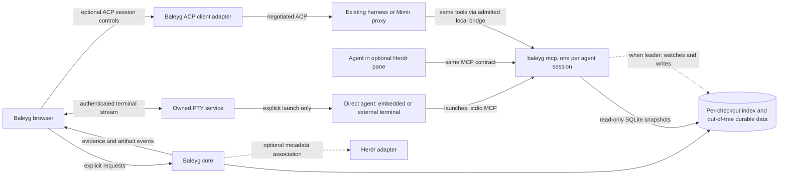

# Baleyg — Architecture Spec

**Status:** implemented Rust daemon and embedded browser with JavaScript/Rust/Java/Python syntax extraction, static sequences and Java/Python class diagrams. JavaScript SCIP import is implemented. Multi-language semantic import, the stdio MCP server, per-checkout indexes with real-time native refresh, coding-agent ACP sessions and diagram artifacts below are accepted direction, not shipped features; mechanics of the index/MCP topology remain proposed until Stage 1 of the semantic-index program ratifies them. The existing one-shot ACP answer adapter is separate. **Direction reviewed:** 2026-09-23.

**Validation:** The first extraction/storage spike is recorded in
[docs/research/EXTRACTION-RESULTS.md](docs/research/EXTRACTION-RESULTS.md). It validates a bounded JavaScript
pipeline, not M4 product usefulness or Java indexing. A subsequent
[view-selection smoke test](docs/research/selection/SMOKE-RESULTS.md) exercised
deterministic filtering, Jev and Claude through ACP. One easy question validated
the integrations, not selector quality. A subsequent
[three-question exploratory comparison](docs/research/selection/HARD-RESULTS.md) found
matching main selections on two questions and a pruning/completeness tradeoff on the
third. These are call-selection sketches, not validated sequence diagrams; the broader
evaluation is still pending.

Baleyg is a diagram-first read surface over a codebase, usable by people and pluggable
coding agents through MCP. Agents may run directly in a terminal, optionally managed by
Herdr, or connect through an optional ACP client/session surface, primarily for Mimir. Point it at a repository and get a readable class diagram; click a
method and get a static sequence diagram. The future product vision adds a database connection
and an ERD joined to the code that maps to it, then diagram edits applied through an agent.

Named for *Báleygr*, "flame-eye", one of Odin's heiti. Sibling to Mimir: the well of
memory, and the eye traded for sight.

---

## 0. Accepted direction and first daemon slice

### Reconciliation and precedence (2026-09-20)

This revision explicitly supersedes the earlier ACP-only / Baleyg-supervises-every-agent
architecture and the earlier claim that LSP is reserved exclusively for writing.
Sections 4, 6, 8 and 12 are the current agent/semantic integration direction:

- MCP is the common portable tool contract for **direct terminal/Herdr agents and ACP agents**.
  Neither Herdr nor Mimir is required. ACP is a supported peer connection mode, not the
  universal agent runtime or the only way tools can be used.
- Baleyg may implement an ACP client UI and supervise an adapter it explicitly starts.
  That is not a new agent reasoning harness. External agents and Herdr panes keep their
  existing lifecycle owner. Mimir's single-client/provider-profile constraints still apply.
- Agents reach Baleyg through `baleyg mcp`, a stdio MCP server the agent client launches in the
  checkout it works in. Each checkout, including every Git worktree, has its own index: a pure cache
  outside the checkout, keyed by the checkout's path. A shared per-file fact cache makes new and moved
  checkouts cheap to index. The first catalog is four read-only tools over syntax-tier evidence. There
  are no grants and no agent network listener; the boundary is the OS user. See the
  [local topology](docs/local-topology.md).
- One process per checkout is the leader, chosen by an OS file lock. It alone watches the files and
  writes native index rows; explicit index requests are queued to it. Native extraction is the only
  automatic work; it executes no repository code. Snapshot text search, artifact writes and broad
  agent orchestration are later independently tested slices.
- SCIP is the preferred batch semantic-artifact route, generalized one language at a time.
  LSP/compiler adapters remain possible complementary read/refactoring providers, not a
  requirement for the MCP pilot. No indexer build, download or repository code runs implicitly.

The [local topology](docs/local-topology.md), [agent integration plan](docs/agent-integration-plan.md),
[read-only MCP contract](docs/mcp-readonly-pilot-contract.md), and
[multi-language SCIP plan](docs/scip-multilanguage-plan.md) elaborate these decisions.
If implementation status is unclear, [README](README.md) describes what currently works.
The experiment/first-daemon subsections below are **historical implementation checkpoints**,
not claims that their later-work lists or provider preferences describe today's deployment.
Other unimplemented shell, database and authoring sections are future product sketches.

### View planning after the selection experiment

Jev is the default **candidate** for fast bounded relevance selection. The exploratory
results suggest comparable usefulness to Opus for these questions, not general model
equivalence or a validated cost ratio. ACP frames the user's intent, seed, scope and
display constraints; Jev selects the first-pass presentation; deterministic code checks
IDs, measured relationships and limits. ACP review is selective (complex questions,
uncertain boundaries or explicit requests), not mandatory on each interaction.

**Evidence needed to understand code is not the same as detail that belongs on screen.**
Prefer immediate interactions. Do not expand helpers merely because they are relevant.
Question-specific deeper steps can be presented within an expandable conceptual step,
with source-backed evidence rather than a box for every implementation function. Neither
fixed traversal depth nor maximum completeness is the product's selection rule.

Keep the measured graph separate from relevance labels, display grouping and human
overrides. An agent cannot create a measured call or convert a callback reference into
execution. Views produced by the current source-order model must be called **static
call views**, not sequence diagrams. True sequence rendering remains gated on evaluation
semantics, branches, ownership and dynamic boundaries.

### Offline question-to-view slice

Implemented after the first daemon: revision-bound question evidence packets, conservative
literal-name previews, strict relevance/display validation, Jev request export and
unverified response import. Evidence depth defaults to 2; visible direct calls remain
capped at 5 unless explicitly changed. Question-bound candidate aliases reject responses
for another question even when measured call sites are identical.

The local preview is not semantic question understanding and is explicitly labeled.
A subsequent [live Jev slice](docs/live-jev.md) adds opt-in provider transport and durable
reservations, independently validated in [the live report](docs/live-jev-validation.md).
ACP intent planning and selective review remain deferred. Full sources are never silently truncated to fit
provider limits. The browser separates focused results from raw outgoing navigation;
individual branch expansion keeps depth 1 as the starting point. Incoming callers and
pinned exploration tabs remain deferred. See [the workflow](docs/question-workflow.md)
and [navigation reference](docs/navigation-reference.md).

### First Rust implementation

Build one vertical slice before the Tauri shell or provider integrations:

1. A CLI indexes a configured JavaScript workspace using native tree-sitter. Optional
   imported SCIP supplies identities and callee resolution, only with a matching paired
   source-hash manifest. No indexer subprocess or repository script runs implicitly.
2. A rebuildable SQLite `cache.db` contains source snapshots, symbols, measured call
   sites, control regions, diagnostics and revision metadata. A full rebuild publishes
   in one transaction. Readers see either the old revision or the new one; cancellation,
   validation failure and revision conflicts leave the old revision intact.
3. A separate `workspace.db` stores view queries, pins, hidden IDs and annotations.
   Missing symbol IDs become explicit orphans; cache deletion must not delete user data.
   Parser-only IDs remain provisional and offset-sensitive. Automatic identity migration
   is not claimed. The durable database binds its state directory to one canonical root.
4. A loopback-only HTTP API serves status, bounded graph queries, cached source, saved
   views and annotations. Explicit refresh runs as one cancellable background job.
   CPU and SQLite work must not block the async request executor. Source lookups may pin
   an expected revision; mismatches return conflicts rather than wrong source spans.
5. A small browser inspection client exercises this API. It is an integration harness,
   not the production React canvas or a successful sequence-diagram usefulness test.

Default state lives outside the indexed repository. Scanning respects ignores, excludes
build/dependency/state directories and does not follow symlinks. The service has no
arbitrary filesystem endpoint, shell execution, provider credentials or paid inference.
A private bearer token, Host checks and same-origin enforcement protect even a loopback
service from web-origin requests and DNS rebinding. Each database has an explicit schema
version; unknown future versions must fail closed without resetting user data.

**Acceptance:** deterministic normalized graph for identical inputs; Unicode source
ranges; call/reference and callback separation; stale semantic invalidation; bounded,
cycle-safe queries; snapshot-consistent reads; rollback and cancellation; durable orphan
handling across cache rebuild; path/origin/auth rejection; and a real fixture-to-browser
smoke test. Record measured results rather than declaring the broader product milestones
complete. Explicit full refresh comes first; watching, dependency-aware invalidation,
Java extraction, semantic-index generation, ACP/Jev adapters, PTY, Tauri and real sequence
rendering remain later work.

The implementation contract and reproducible commands live in
[docs/daemon-v1.md](docs/daemon-v1.md). The first-pass result is recorded in
[docs/daemon-validation.md](docs/daemon-validation.md): native extraction, storage,
API and inspector checks passed. The product-level diagram and provider gates remain open.

## 1. Scope

| Phase | What ships | Gated on |
| --- | --- | --- |
| 1. Read | File/method browsing, static sequences, class diagrams; portable MCP tools for direct terminal/optional Herdr agents or optional ACP sessions | Measured extraction + per-checkout stdio MCP; neither terminal embedding nor ACP is required for MCP |
| 2. Data | DB connection, ERD, `mapsTo` links from entity types to tables | Phase 1 model, driver sandboxing |
| 3. Author | Edit on canvas, diff revisions, agent writes the code | Phases 1–2 plus a real identity story |

**Non-goals.** No text editor — the agents edit. No debugger. No attempt to be an IDE.
The file viewer is read-only with syntax highlighting and jump-to-symbol.

## 2. The central design decision

**The codebase is the source of truth. The graph is a derived index.** If the model and
the code disagree, the code wins and the model re-derives.

The index exists because the codebase, as a pile of files, cannot answer the questions
Baleyg asks:

- **There is no query language over a codebase.** "Which types in this package
  transitively reach the payment gateway" is a traversal, and traversals need a
  structure to traverse.
- **Latency.** A sequence diagram is a recursive expansion. Resolved live, that is
  hundreds of round trips serialised by depth. Interactive means under 100ms.
- **Some facts are not in the code.** Layout pins, hidden nodes, notes, agent-inferred
  edges, ORM mappings, provenance. These are annotations keyed to symbols and need
  somewhere durable to live.
- **The database schema is not in the repository at all.**

### The discipline that keeps this honest

The store is split in two, physically:

- **The index** — derived source snapshots, graph and class projections. A pure cache: deletable,
  rebuilt deterministically, never authoritative, never migrated. FTS and broader edge kinds are not
  implemented. Today this is `cache.db` in an out-of-tree state directory. The accepted direction
  keeps it out of tree in the per-user cache directory, keyed by the checkout's canonical path
  (see [local topology](docs/local-topology.md#storage)).
- **`workspace.db`** — durable views and annotations today; versioned artifacts and other proposed
  records later. References to missing symbol IDs become orphans; a cache rebuild does not guarantee
  automatic reattachment. The accepted direction keys it by a workspace UUID kept in the checkout's
  Git directory, so views and notes follow a moved checkout. Tokens and ledgers stay at explicitly
  configured paths outside every checkout. There is no `--state-dir` flag and there are no state
  migrations; existing views and notes are not carried over.

With identical source bytes, pinned extraction tools, semantic-index artifacts and
database snapshots, deleting the index must reproduce the same normalized semantic
graph. Preserve accepted agent output and layout decisions in the durable store.
SQLite file bytes and renderer pixels are not the determinism contract.

## 3. Stack

**Implemented:** Rust core daemon, SQLite and an embedded browser client using local
JavaScript/CSS/SVG assets. There is no embedded terminal or React/Tauri shell today.
The choices below are a future packaging sketch, not prerequisites for MCP or ACP.
Indexing, queries and any explicitly owned adapter processes belong behind bounded,
cancellable core services; externally run agents stay externally owned.

| Concern | Choice |
| --- | --- |
| Shell | Tauri 2 |
| Terminal PTY | `portable-pty` (no native-module prebuild matrix) |
| Parsing | tree-sitter, native bindings, `rayon` for parallelism |
| Store | SQLite (rusqlite), WAL |
| ACP | official Rust library, behind a thin local adapter |
| Front end | React + TypeScript, Vite |
| Canvas | React Flow (xyflow) |
| Graph layout | ELK.js, `layered`, in a worker |
| Terminal UI | xterm.js |

**Current development mode: a plain daemon with an embedded browser front end.**
A future packaged shell could add xterm.js over a WebSocket and a Vite development server. Wrap it in
Tauri when the product loop is proven. Framework packaging must not block the part that
is actually hard.

**Known risk:** WebKitGTK is the weakest of the three webviews and this is a
canvas-heavy app. If Linux becomes a first-class target and rendering diverges,
reconsider.

## 4. Processes and connection modes

The core owns Baleyg's stores, query services and UI events. It supervises only processes
that Baleyg explicitly launches, such as a future ACP adapter. It does **not** own every
agent, shell or Herdr pane associated with a project. `baleyg mcp` processes are owned by the
agent clients that launch them and exit with those clients; they need no supervisor. The browser
daemon and any `baleyg mcp` process share each index through SQLite: whichever holds the leader lock
watches and writes; the others read and queue explicit index requests to it.



**Direct mode.** The user launches an MCP-capable agent in a Baleyg terminal tab, a normal
terminal or Herdr and configures Baleyg's MCP server. No ACP client, agent registry, Baleyg-owned PTY or Herdr
connection is required. The existing harness owns its agent lifecycle and write/command policy.

**ACP mode.** Baleyg may offer a client/session UI to launch or connect to an explicitly
configured ACP adapter, primarily Mimir. ACP carries prompts, progress, cancellation and
negotiated permission requests. The same Baleyg MCP tools remain the code/diagram interface.
Client-hosted tools for a remote Mimir brain need its reviewed provider extension; arbitrary
MCP servers cannot simply be added to today's fixed Hands profile. Do not attach a second
observer/client beside an existing Mimir ACP client when the daemon admits only one.

**Optional Herdr integration.** Discover workspace/pane/recognized-agent metadata and maintain
explicit associations. Later user-initiated focus or prompt actions require target revalidation.
Do not scrape terminal text as a tool protocol, steal focus, invent supported agent kinds, or
close/restart external processes. A discovered workspace is not an indexing or access grant.

**Accepted target UI: one workbench.** Keep diagrams and source in the main area, with docked,
resizable terminal tabs so the user can watch and operate agents without leaving Baleyg. ACP
conversation/tool/approval tabs belong in the same workbench but are not fake terminal streams.
External terminals remain supported; embedding is not a requirement for the MCP server.

A direct agent launched from Baleyg gets a real PTY and bounded/backpressured browser rendering
(for example, a local xterm.js client with a Rust PTY host). A Herdr-managed terminal may be
embedded only through a supported, tested attach/stream interface; metadata subscriptions,
`pane.read` snapshots and `pane.send_input` alone do not establish a faithful interactive PTY.
An explicit Herdr TUI attachment inside an owned PTY is a possible separate experiment, not proof
of per-pane embedding. No parallel owner, automatic takeover or killing external processes.

IPC, output history and resize/input queues must be bounded. Authenticate terminal transport,
verify Host/Origin, exclude credentials from URLs/logs, and require an explicit grant for input.
Treat terminal control sequences as untrusted: clipboard writes, external links and other side
effects need a deliberate policy. Browser refresh/disconnect must not silently destroy a session;
terminate is a separate explicit operation limited to processes Baleyg owns. Source/diagram
selection or publication must not start inference, read source, or execute commands. Cancellation
revokes future operations but cannot undo completed effects or unsend disclosed source.
See the [terminal workbench contract](docs/terminal-workbench-contract.md).

## 5. The semantic model

One typed graph covers class diagrams, sequence diagrams and ERDs. Nodes include
modules, standalone functions, types, methods, fields, tables and columns. Edges are `extends`, `implements`, `contains`,
`hasField`, `calls`, `references`, `fkTo`, `mapsTo`. An ERD is not a special case; it is
a subgraph whose nodes happen to be tables.

### Identity

SCIP supplies semantic symbol strings; local SCIP IDs require document/artifact scoping.
The existing JavaScript importer replaces syntax IDs with imported identities. **Owner decision
(2026-09-23): that behavior is removed.** Every language uses **stable syntax IDs** for declarations:
`sid:v1:` plus the first 128 bits (32 lowercase hex digits) of the domain-separated SHA-256 digest
of the canonical source-set, path, language, and declaration key (enclosing declarations, kind,
exact measured name, Java overload signature or same-key sibling ordinal). Range and file content
hash remain separate fields, so a body-only edit changes no IDs. Readable path/key strings are
separate presentation-only `displayKey` values, never identity, accepted input, or hashed. SCIP
symbols remain in a separate binding layer, never as node IDs. Call sites and control regions use
revision-local `occ:v1:` IDs: the first 128 bits of the digest over revision, shortened owner syntax
ID, occurrence kind and ordinal. Backward compatibility is not required for this change.

Identity and location are separate fields. Renames and moves of a declaration change its ID;
annotations on a removed declaration remain visible orphans. Durable anchors also store a hash of the
declaration's projected header metadata, so an ordinal that shifts onto a different same-named
sibling orphans the anchor instead of silently moving it. Identical-header sibling anchors also
require independently established group continuity; changed or unknown continuity orphans them.

Illustrative only: node IDs are stable syntax IDs; the SCIP symbol is a separate binding; a measured
call site keeps its own identity, separate from its declared target and dispatch kind. These example
hashes assume logical source set `core`, Java, the displayed paths, `type` declaration keys for
classes, zero-based declaration ordinals, ordinary Java method signatures (empty except
`rateFor(Region)`), and revision `rev-148` for occurrence IDs. `displayKey` is a readable result
label, never an identity or request selector; this is not a complete v1 DTO schema.

```json
{
  "schemaVersion": 1,
  "nodes": [{
    "id": "sid:v1:b70d3246cbc86a736696fb558d1e2348",
    "displayKey": "src/main/java/com/acme/billing/Invoice.java#class:Invoice",
    "kind": "type",
    "name": "Invoice",
    "container": "com.acme.billing",
    "anchor": { "path": "src/main/java/com/acme/billing/Invoice.java",
                "range": [420, 2310], "blob": "9c1f8a2e" },
    "provenance": { "source": "treesitter", "evidenceKind": "measuredSyntax", "indexRev": 148 }
  }],
  "semanticBindings": [{
    "node": "sid:v1:b70d3246cbc86a736696fb558d1e2348",
    "symbol": "scip-java maven acme/billing 1.4 com/acme/billing/Invoice#",
    "provenance": { "source": "scip", "evidenceKind": "declarationBinding", "indexRev": 148 }
  }],
  "callSites": [{
    "id": "occ:v1:c5fb440e061729989aca50c29a8f0b5c",
    "displayKey": "...Invoice.java#class:Invoice/method:total()@call:3",
    "caller": "sid:v1:f2ff8bd933db88969122e5d61d873746",
    "range": [1312, 1340],
    "ordinal": 3,
    "regions": ["occ:v1:e7bdfb1616a2481d2ea152a56d2c5698"],
    "provenance": { "source": "treesitter", "evidenceKind": "measuredSyntax", "indexRev": 148 }
  }],
  "callBindings": [{
    "callSite": "occ:v1:c5fb440e061729989aca50c29a8f0b5c",
    "declaredTarget": "sid:v1:7bfe74998e06c7d1c080fe6f60acf8f3",
    "dispatch": "virtual",
    "disposition": "resolved",
    "provenance": { "source": "scip", "evidenceKind": "declarationBinding", "indexRev": 148 }
  }]
}
```

### Provenance is mandatory

Every node and edge records whether it came from a parser, an index, an agent or a
human. This is the difference between a diagram you trust and one you must re-verify.
Agent-inferred edges belong to separately labelled authored explanations, never the measured
cache. A user may accept an explanation, but that does not promote its edges into measured facts.
Compiler declaration binding also does not prove which override or runtime object executes.
Use explicit evidence categories, not an invented numerical confidence, to distinguish these cases.

### Sequence diagrams need explicit call sites and control regions

Call-site identity, control regions, and ordering semantics. Repeated calls to one
target are distinct call sites. Branches need region ids, parent regions, arm labels
and source spans; `{in, depth}` alone cannot distinguish sibling branches.

Source ranges recover **lexical order**, not execution order: in `f(g())`, `g` executes
first. Callback bodies are separate functions, not calls executed when passed as
arguments. Async scheduling is not an ordinary synchronous edge. Until evaluation
order and these boundaries are modeled, label the output a static source-order view,
not an execution trace. The JSON below and Appendix A are illustrative, not a complete
sequence schema.

### Live views and published artifacts are different

A live view is a query plus overrides: seed, bounded traversal, pins, hidden IDs and notes.
On reindex, reevaluate only against an explicit new basis and expose orphaned IDs. Current
saved views implement a subset of that model. The IDs in the example are stable declaration IDs;
readable display keys appear only in presentation results, not saved-view selectors. Anchors survive
body edits under the contract's continuity rules and orphan on removal, rename, changed header, or
unsafe sibling-group change.

A proposed **published artifact** is an immutable version: preserve its query/options, frozen
server-produced DTO or explicitly agent-authored graph, provenance and evidence basis. It must
not silently change when the index changes. Frozen diagram data is intentional here; it does not
promise historical source retention. Source links may become stale/unavailable. Authored diagrams
remain distinct from evidence views even when they cite valid source ranges.

```json
{
  "viewId": "v_8f21",
  "kind": "sequence",
  "query": { "seed": "sid:v1:a10398f88e7a816d9be9dc7a223dbaf8", "depth": 3,
             "edgeKinds": ["calls"], "excludePackages": ["java.util"] },
  "pins": { "sid:v1:73cb719e7a1458a1ad243bc28da2e229": { "x": 420, "y": 80 } },
  "hidden": ["sid:v1:16cd2ced398a21036bd15efffdec0434"],
  "notes": [{ "anchor": "sid:v1:a10398f88e7a816d9be9dc7a223dbaf8", "body": "retries twice" }]
}
```

## 6. Extraction and semantic enrichment

**Deterministic tools supply measured evidence; agents select, explain and propose.** Neither
an agent explanation nor a compiler declaration binding is an observed runtime trace.

### Current implementation versus accepted direction

- Implemented: native tree-sitter JavaScript, Rust, Java and Python extraction, plus optional
  JavaScript SCIP import with paired source-hash freshness checks. The SCIP decoder/importer
  lives in `src/indexer.rs`; there is no separate `src/scip.rs` today.
- Not implemented: semantic import for the other three languages, automatic indexer execution,
  LSP/compiler overlays, TypeScript syntax/sequence coverage, or universal full call resolution.
- Accepted direction: generalize **artifact import first**, using a common bounded SCIP reader
  plus tested language-specific declaration/reference joins. Prioritize Java, then Rust/Python
  as independently gated slices. See [the multi-language plan](docs/scip-multilanguage-plan.md).

### 6.1 SCIP is a format, not a universal call graph

SCIP can describe symbols, definitions, references and relationships for many languages.
Candidates to evaluate include scip-java, rust-analyzer's SCIP exporter and scip-python.
A producer name is not proof it supports the project's language version, build layout,
annotation-generated members or all desired relationship kinds. Pin and test each producer.

Keep the responsibilities separate:

| Evidence | Producer and acceptance rule |
| --- | --- |
| Syntactic declarations, invocation sites, evaluation/control structure | Native language adapter with measured ranges |
| Semantic symbol/declaration bindings and relationships | Validated SCIP artifact or future compiler/LSP provider |
| Runtime dispatch and callback execution | Often unknown; never inferred merely from a reference binding |
| Relevance, conceptual grouping and explanations | Agent-authored view metadata with provenance |
| Proposed architecture or dynamic links | Separate authored artifact, assumptions visible |

Only a semantic occurrence joined to an **actual measured invocation/callee span** can enrich
that call. A general reference, method reference or passed callback is not a call. Definition
`enclosing_range`, roles and relationship coverage vary by producer and must be checked.
Validate position encoding and convert to measured UTF-8 byte ranges; never assume all artifacts
use the JavaScript producer's UTF-16 conventions. Ambiguous/unsupported joins remain explicit.
Local symbols need document scope, while external declarations remain external boundaries unless
an independently authorized source/evidence contract supports more.

Store declared binding and dispatch certainty separately before enabling broader traversal.
The current `Internal` call state is traversed by graph queries; do not set it for every virtual
or interface binding and thereby imply a known runtime implementation. Semantic warnings must
survive cached queries, diagrams and hashed evidence packets, not just indexing diagnostics.

### 6.2 Import is separate from producing an index

Phase one accepts an explicitly supplied `.scip` artifact and a matching snapshot/manifest.
It does not run an indexer, package manager, compiler plugin, build script or annotation processor.
Java producer workflows may require build integration; Rust export may invoke Cargo/build scripts
or proc macros; Python indexing still needs correct source/dependency/environment configuration.
Treat producer execution as a separate trusted operation with explicit toolchain and execution policy.
Artifacts produced elsewhere or in CI can be imported without reproducing that execution locally.

Freshness must cover source bytes and the relevant tool/config/dependency basis, not only a commit
SHA: dirty trees, non-Git roots and unchanged files with changed dependencies exist. Retain producer
version, language/encoding metadata, manifest hashes and admitted root mapping. Reject mismatched,
malformed, oversized or unsupported artifacts before publication. Do not download tools on opening
Baleyg or silently retry a build to resolve missing evidence.

Stale semantic evidence must be rejected or downgraded visibly, preserving syntax-only browsing.
The current system uses explicit full refresh. The accepted direction adds a file watcher that refreshes
**native** evidence per changed file (§7.2). A changed file's semantic overlays stop applying, because
they are keyed by its old content hash. Other semantic facts are reported possibly stale, computed at
read time, whenever any declaration surface or build/configuration input in their source set changed
after they were imported. This is conservative by design. The watcher never runs a producer. None of this is implemented yet.

### 6.3 LSP and compiler APIs remain complementary

SCIP is well suited to repeatable offline/batch import and CI artifacts. LSP can provide interactive
definition/type/reference navigation and later refactoring; a compiler API can provide a bounded
batch overlay. They are not restricted to writing, and SCIP does not make interactive servers
unnecessary in every workflow. Conversely, an LSP `Location` alone is not a stable symbol identity
or proof of binding quality. Validate snapshot alignment, errors, mappings and server capabilities.

The [Java semantic investigation](docs/java-semantic-indexing-plan.md) is research, not an enabled
resolver or permission to acquire JDT/build the inspected application. Investigate an optional
read-only bridge, Java/JDT LS first, then rust-analyzer, Pyright and a tsserver LSP wrapper as useful.
See the [LSP assessment direction](docs/lsp-integration-plan.md) for snapshot/live separation,
capability validation and explicit startup/build policy. No language server is a prerequisite for
MCP. Choose and validate semantic producers separately from agent transport.

### 6.4 What the agent contributes

Agents choose useful scope, name groups, explain branches, connect evidence across files and
propose architecture. Static analysis can often recover **some** framework/DI/runtime relationships;
others remain uncertain. Neither “all dynamic behavior is invisible” nor “the agent fully resolves
it” is a valid guarantee. Preserve the distinction between evidence, candidate and hypothesis.

## 7. The index

### 7.1 Construction

Accepted incremental direction below; current publication is explicit full-index rebuild.
Three conceptual passes, keyed on source and relevant extraction/configuration hashes.

1. **Discover and hash.** Walk respecting `.gitignore` with the existing walker. Record
   `(path, size, mtime, ctime, inode, hash)`, hashing only files whose stat changed (Git's
   racy-timestamp rule applies). This table *is* the incrementality story. No `git` subprocess runs.
2. **Parse.** tree-sitter per file, in parallel, a pure function of file bytes and
   therefore cacheable by hash. Emits local nodes, unresolved references, call
   ordinals, control context. Results live in a per-user **fact cache** as a path-neutral record
   keyed by language, extractor version, extraction-context digest and content hash, shared by every
   checkout on the machine. Assembly binds records to paths and derives the node IDs. A new or moved
   checkout parses only files the cache has never seen.
3. **Enrich.** Ingest admitted semantic artifacts through the appropriate language adapter.
   Syntax-only import/name matching may provide explicitly scoped navigation candidates, not
   resolved dispatch. It must never silently replace missing compiler evidence with a guessed call.

### 7.2 Maintenance

Watcher, incremental invalidation and scheduling below are accepted direction with proposed mechanics
([local topology](docs/local-topology.md#leader)), not current behavior or permission to execute
producer tools. Automatic producer scheduling stays off.

- **Leader.** An OS file lock picks one process per checkout. It alone writes native rows, running
  watcher batches, reconciles and explicit requests one at a time from a single ordered queue. On
  taking the lock it reconciles against the files; apart from a brief documented takeover window,
  which serves only the previous leader's last reconciled revision, evidence is served only once the
  current leader has done so. It re-checks that the root path still names the same directory before every
  reconcile and publish. Other processes queue explicit requests in a small database that survives
  index rebuilds; if there is no leader, the requester becomes one.
- **Watcher.** FSEvents / inotify through the `notify` crate, debounced, re-extracting changed files
  (or taking them from the fact cache) and publishing one short transaction per batch. Overflow, lost
  events, watch-limit exhaustion, bulk changes and system wake trigger a full stat reconcile; a slow
  periodic reconcile catches silently lost events. A branch switch is just a bulk change.
- **Re-resolution.** Bindings record the names they looked up, including lookups that found nothing,
  and the scopes they traversed (enclosing classes and modules, supertypes, imports, re-export
  sources). A publish diffs each changed file's old and new declarations and re-resolves bindings that
  recorded any name whose declaration was added, removed or changed in anything a lookup can see. Stable IDs
  mean a body-only edit re-resolves nothing. Above a threshold, re-resolve everything.
- **Cancellation over speed.** Every pass must abort cleanly mid-flight; the user will
  switch branches while indexing.
- **Atomic revisions, not timestamps.** Each publish is one SQLite transaction and advances the
  revision. Readers pin a WAL read transaction. Only the current graph is retained.
- **Semantic evidence.** Producers run only through the explicit owner workflow. Imported facts are
  overlays that apply only while their document's content hash matches. An artifact whose manifest
  does not match the current source set at import is possibly stale from the start; afterwards,
  freshness is computed at read time against the last surface or configuration change in its source
  set or any source set it depends on.
- **Cache discipline.** Any schema, extractor or integrity mismatch means rebuild, inside the existing
  file with a new generation; the file is deleted and recreated only when SQLite can no longer open or
  rebuild it, and only while no process holds it open. Nothing in the index is migrated or repaired.
- **Cleanup.** Automatic for derived state: indexes for vanished or long-unused paths (only when no
  process has them open) and fact-cache entries beyond a size cap are deleted by the leader at most
  daily. Durable records are created only on first write and never deleted automatically; orphaned
  ones are reported, and `baleyg forget` deletes one explicitly. Ledgers are never touched.

### 7.3 Storage

SQLite, WAL: a per-checkout index cache, durable data keyed by workspace UUID, and a per-user fact
cache, all outside the checkout (§2, §7.1). Traversals are recursive CTEs
and must be benchmarked on representative views. Illustrative DDL is in Appendix A;
revision publication and sequence-region tables are not yet a production schema.

The one alternative worth benchmarking is **KuzuDB** — embedded property graph, Cypher,
single file. If traversals become variable-length filtered paths, Cypher beats
hand-written CTEs by a wide margin. The cost is a second storage engine, since
`workspace.db` stays SQLite. Decision: SQLite first, move only when a specific query
measurably hurts.

Do not use a server-based graph database. Do not keep the graph in memory only.

### 7.4 Prior art to read before writing any of this

| What | Why |
| --- | --- |
| [SCIP](https://scip-code.org/) | The format and its indexers. Apache-2.0, neutral governance, Sourcegraph funds a maintainer |
| [scip-io](https://github.com/GlitterKill/scip-io) | Orchestrates installing, running and merging SCIP indexers across languages |
| [codegraph](https://github.com/colbymchenry/codegraph) | tree-sitter → SQLite + FTS5, file watcher with debounce, content-hash reconciliation, served over MCP. Essentially tier 0, already written |
| [salsa](https://docs.rs/salsa) | Incremental memoized queries with cancellation |
| [multilspy](https://github.com/microsoft/multilspy) | Possible reference for headless LSP integration; not the selected Rust-core client |

Kythe and Glean are built for fleet-scale server deployments and are too heavy here.
Joern/CPG is the right shape but heavyweight and security-oriented. CodeQL has excellent
databases and licensing that does not permit closed-source commercial use — check before
building on it. LSIF is superseded by SCIP.

## 8. Agent integration: MCP tools, direct terminals and ACP

**The same MCP tools must be available in both connection modes.** This section supersedes
the original ACP-only launcher/registry topology and its prototype `query_graph`, `get_symbol`,
`emit_diagram` names, and the later owner-grant pilot. The [local topology](docs/local-topology.md),
[integration plan](docs/agent-integration-plan.md) and [MCP contract](docs/mcp-readonly-pilot-contract.md)
define the portable `baleyg_*` names. These tools and the general coding-agent client are not
implemented yet.

### 8.1 Direct agents, including embedded terminals

An agent can run in an ordinary terminal, in a Baleyg-owned terminal tab, or in an optional
Herdr pane. Configure the proposed `baleyg mcp` stdio server through that agent's supported
MCP settings; the agent client launches it in the checkout it works in, and the server serves that
checkout only. Baleyg need not become its ACP client or its reasoning harness. A user may
continue to launch agents outside Baleyg; tools and published diagrams work the same way.

The target workbench includes terminal tabs alongside diagrams and source (§4). MCP and PTY
transport are independent: terminal output is not a substitute for validated tool results.
Herdr discovery does not automatically configure MCP, authorize source access, or transfer
control of an existing pane. A remote agent needs an explicitly secured local-tool bridge,
not an assumption that local stdio or localhost is reachable from its machine.

### 8.2 ACP client sessions, primarily Mimir

Baleyg may provide an ACP conversation/session surface and start a configured local adapter
when explicitly requested. That adapter can connect to the existing Mimir runtime/proxy, or
another ACP-compatible harness. Reuse the harness's agent loop, provider routing and permission
policy instead of implementing another loop in Baleyg.

Negotiate actual protocol/capabilities and test the selected adapter version. Supply the same
Baleyg tool contract through the agent's **admitted** MCP configuration/provider mechanism.
Do not assert that every ACP peer accepts arbitrary `mcpServers`, supports identical transports,
or implements a particular ACP major version because a registry lists it.

Mimir currently admits one fixed five-tool Hands profile and one ACP client per daemon home.
First-class client-hosted Baleyg tools require a versioned Mimir provider extension. Baleyg can
be the chosen ACP client, but must not silently establish a second observer alongside an editor.
Switching client ownership or adding multiplexing is separate explicit work. Mimir's generic
MCP client on the daemon host is useful only when that is the intended data/tool host.

ACP streams structured messages, tool activity and approvals, **not terminal bytes**. Display
those in their own tab/panel; show an actual terminal separately when a real PTY is available.
Do not expose the ACP adapter's protocol stdout as an interactive terminal or scrape chat into
fake tool calls. `_meta` correlation is not a replacement for a versioned tool schema.

### 8.3 Tool authority and first pilot

The first catalog is `baleyg_workspace_describe`, `baleyg_find_symbols`, `baleyg_inspect` and
`baleyg_read_source`, served by `baleyg mcp` over stdio (MCP `2026-07-28`). The first release of
`baleyg_inspect` offers `declaration`, `outgoing_calls` and `incoming_calls` over syntax-tier evidence;
later stages add views and semantic evidence. Every result reports its basis
`{indexGeneration, indexRevision}` and per-item tier and freshness; pins are optional, carry the
complete basis, and always conflict when stale. No registry, grep scan, artifact write, shell or on-request index operation is part
of this path. Snapshot text search gets its own bounded literal-scan design; FTS does not exist today.

There are no agent grants, principals or budgets. stdio has no network surface, so there is no
Host/Origin exposure and other OS users cannot connect. The boundary is the OS user: any
same-user process can launch the server or read the index file, just as it can read the source.
Configuring the server for an agent approves disclosure of the whole indexed checkout to that agent
and its provider. The browser's bearer token remains the browser's credential and is never given
to agents. A tool's `readOnlyHint` is not access control.

The same rules apply whether the caller came from a direct terminal, Herdr, or ACP.
Remote disclosure needs a runtime/destination policy; MCP alone cannot attest the downstream
model provider. Read-only does not mean non-sensitive. A hostile-agent threat model needs a
separate OS account or sandbox, not a narrower MCP catalog.

### 8.4 Permissions, launch configuration and ownership

Configure adapters as explicit data: command/profile, transport, workspace binding, supported
capabilities and negotiated version. Never execute an agent-supplied launch command or silently
install a harness. Baleyg supervises only its own explicitly launched children; attach/detach
must not kill externally owned agents, Herdr sessions or remote Mimir daemons.

Do not automatically declare filesystem/terminal capabilities just because Baleyg has a source
viewer or terminal UI. Each advertised ACP capability needs an implemented and approved provider,
with its own scope, cancellation and permission behavior. Mimir Hands authorization, operator
approval and taint checks remain additional gates. Read/disclosure, artifact write/publication,
repository edit, command execution, indexing and runtime control are separate permissions.

### 8.5 Diagram output

Agents use typed tools, not parsed chat text. Deterministic evidence views are generated by
Baleyg projectors; agent-authored explanatory/proposed graphs have a separate validated schema
and visible attribution/assumptions. No agent can promote its own edges to measured facts.
Artifacts use idempotent creation, version/CAS checks and explicit local publication. The browser
receives an inbox event/deep link; publication must not steal focus, run a provider, or fetch source.

## 9. Rendering

Three renderers over one model, not one renderer with three modes. Class diagrams and
ERDs are node-link graphs and share almost everything. Sequence diagrams are not graphs
— they are lifelines on one axis and time on the other.

| Surface | Pick |
| --- | --- |
| Class diagram and ERD | React Flow (xyflow); custom nodes are plain HTML, and it is already an editor for Phase 3 |
| Graph layout | ELK.js `layered` in a worker |
| Sequence diagram | Hand-written SVG, ~400 lines, owning every click target |
| Export | Mermaid, SVG, PNG |

**Mermaid is an export format, not a rendering strategy.** Generating Mermaid for
pasting into pull requests is a real feature. Rendering *through* Mermaid gives no
stable element identity, no click-to-source, and no control over activation bars or
`alt`/`loop` frames.

**Cap diagram size as a product rule.** Past roughly 150 boxes a class diagram is a
poster. Default to a seeded query with a depth limit, expand-neighbours on each node,
and collapse the frontier into package-level nodes. Enforcing this also keeps SVG fast
enough that no WebGL renderer is ever needed.

**Preserve the mental map.** Once a user drags a node its position is pinned and layout
never moves it again. When re-indexing adds nodes, lay out only the new ones against
fixed old ones. A diagram that reshuffles after every save is one users stop opening.

**Sequence layout.** Lifelines are columns ordered by first appearance; messages are
rows in `ordinal` order; `control` becomes nested `alt`/`loop`/`try` frames drawn as
labelled rectangles spanning the participating columns. Self-calls get a loop-back arrow
and an activation bar. Every arrow carries its edge id so clicking opens the call site.

## 10. Database and ERD

**The differentiating feature is the `mapsTo` edge, not the ERD.** Standalone ERD tools
are a solved and crowded space. What nobody does well is joining the data graph to the
code graph: click a table, see the entity class, see the repository that queries it, see
the service that calls the repository. That chain is one traversal. Harvest the mapping
from ORM metadata — JPA/Hibernate annotations, SQLAlchemy models, Prisma schema,
ActiveRecord, Ecto — and fall back to the agent where conventions are implicit.

**Per-engine introspection, not an abstraction layer.** Each engine's catalog query is
about a hundred lines and they disagree in ways no common interface survives:
`pg_catalog` for Postgres constraints, partial indexes and enums; `information_schema`
for MySQL; `PRAGMA` for SQLite; `sys.*` for SQL Server.

**Infer undeclared foreign keys.** Plenty of production schemas have no FK constraints.
Infer from column naming, index presence and sampled value containment; write them with
inferred provenance; render dashed. A correct-looking ERD with silently guessed
relationships is worse than no ERD.

**Credentials and the agent boundary.**

1. Drivers run in the core process. The webview never sees a connection string.
2. Credentials live in the OS keychain. Never in `workspace.db`, never in the repo.
3. **The agent gets the introspected schema, never a connection.** It is a model with
   shell access reading a codebase that may contain adversarial text; a live handle to a
   production database is not a risk worth taking for a diagram.

If data sampling is later wanted, expose it as a narrow MCP tool — read-only
transaction, statement timeout, row cap, tables allowlisted per connection — off by
default.

Nearly free follow-on: diff the live schema against the repo's migration files and show
drift on the ERD.

## 11. Phase 3 — diagram to code

Model-driven round-trip engineering failed for thirty years because diagrams
underspecify code, generators filled the gap with templates, and templates produced code
nobody wanted to own. Protected regions were the symptom, not the cure.

What changed is gap-filling: an agent reading the surrounding codebase infers
conventions, naming, error handling and test style, so it does not need a complete
specification. What has not changed is acceptance — you still cannot tell by looking
whether the generated code matches the diagram.

**So do not generate from the diagram. Generate from the diff, and verify by
re-indexing.**

1. The user edits the canvas. Compute a semantic changeset against the model, not a
   picture: `addMethod(Invoice, applyDiscount(Money) -> Money)`,
   `extractInterface(PaymentGateway, [authorize, capture])`,
   `addColumn(invoice, discount_cents, bigint not null default 0)`.
2. Split it. Use an LSP refactoring only when the chosen server supports it and its
   document/configuration basis is valid. Preview and explicitly approve edits; reject stale
   versions. Rename/move/extract/change-signature support is not universal or automatically exact.
3. The remainder goes to the agent as an explicit instruction list, fetched through the
   MCP server rather than pasted into a prompt.
4. Re-index the touched files.
5. Diff the measured model against the model the user drew. Report per change: applied,
   partially applied, or diverged.

Step 5 is the whole thing — a predicted-versus-measured loop where the intended model is
the prediction, the re-indexed model is the measurement, and the residual is what the
user sees. Without it this is a code generator people abandon after the third surprise.
With it, partial application is a visible, actionable state, and the divergences become
the next instruction to the agent.

Two hard rules. Never regenerate a file wholesale — every change is an edit to existing
code. Never introduce protected regions or generated-code markers.

## 12. Build order and current integration slices

Existing browsing, static sequences and class diagrams stay usable throughout. This order
supersedes the old requirement to build an embedded terminal at M0 or route all agents through
an ACP harness registry. It distinguishes the small first tool pilot from the target unified UI.

| Slice | Runnable acceptance |
| --- | --- |
| A. Per-checkout read-only MCP | `baleyg mcp` over stdio in any checkout or worktree; describe/find/inspect/read with revision pins; real-time native refresh by the leader; no ACP, Herdr, registry or grants required |
| B. Bounded snapshot text search | Literal scan over cached payloads with separate byte/time/result budgets, cancellation and explicit partial results; no FTS assumption |
| C. Versioned diagram artifacts | Evidence view or clearly authored draft -> CAS update -> local publish -> user opens deep link; stale source stays honest |
| D. Unified workbench terminals | Real PTY tab for a user-launched direct agent, the same MCP tools, bounded terminal stream and explicit lifecycle/input permissions |
| E. ACP client integration | Chosen adapter/Mimir proxy session, negotiated capabilities and same admitted MCP tools; no duplicate harness or second observer connection |
| F. Optional Herdr integration and multi-project UI | Read-only association first; independently verified terminal attach later; per-project routing without merging stores |
| G. Multi-language semantic import | Java then independently gated Rust/Python artifacts; exact snapshot/range joins, provenance and dispatch-safe traversal |

Some slices can proceed in parallel once their contracts settle. The semantic-index program
([#8](https://github.com/jasoncarreira/baleyg/issues/8)) sequences slices A and G: slice A ships
with syntax-tier evidence right after the graph core, and slice G then enriches the same tools. SCIP does not
require an MCP/ACP agent, and the read-only MCP surface does not require semantic resolution,
embedded terminals, a project registry, snapshot search or paid inference. Embedded terminals
are an accepted target UX, not a reason to expand the security-critical pilot.

Database/ERD integration and diagram-to-code remain later product work with separate authorization.

## 13. Risks and open questions

**Readability is the product risk, not extraction.** Nearly every UML-from-code tool
could extract a class diagram; they died because the diagram was unreadable. The
differentiator is the agent deciding what to leave out. Budget real effort there.

**Degraded mode will be silent unless made loud.** Show the active extraction tier per
workspace, always, and the age and basis of semantic evidence. With real-time native refresh,
semantic evidence lags edits by design; every result must say so.

**Many live checkouts.** Agents work in several worktrees at once. Index cost must scale with what
each checkout changed, not its size; processes must end with their clients; and storage must be
reclaimed when checkouts disappear. See the [local topology](docs/local-topology.md).

**Indexer coverage varies.** Validate a pinned producer against the exact language/toolchain,
position encoding, ranges, roles and relationships needed by each adapter. Do not infer maturity
or complete runtime resolution from the SCIP format or a producer's name.

**Protocols and providers vary.** Pin and negotiate the actual MCP/ACP adapter versions and
capabilities. A registry entry is discovery metadata, not a compatibility or permission guarantee.

**Agent cost per diagram is a real constraint.** Cache on model revision plus query, and
show the cost of a regeneration before it runs.

**Scope.** Five subsystems — indexer, canvas, terminal, agent client, database layer —
and any one is a project.

### Open

- [ ] Which repository is the test subject for M1–M4? Picks the first language and
      probably the first ORM.
- [ ] Single repository, or service graphs spanning several? Cheaper to decide now.
- [ ] Personal tooling or a shipped product? Decides signing, auto-update, telemetry.
- [ ] Must codebases stay on-machine? Constrains which harnesses are usable.

---

## Appendix A — illustrative schema (not finalized)

### Index (`cache.db` today; per-user cache keyed by checkout path, proposed) — derived, deletable

```sql
CREATE TABLE files (
  path       TEXT PRIMARY KEY,
  lang       TEXT NOT NULL,
  hash       BLOB NOT NULL,              -- blake3 of contents
  size       INTEGER NOT NULL,
  mtime_ms   INTEGER NOT NULL,
  index_rev  INTEGER NOT NULL
) WITHOUT ROWID;

CREATE TABLE nodes (
  id          TEXT PRIMARY KEY,          -- stable syntax ID; SCIP symbols live in a binding table
  kind        TEXT NOT NULL,             -- class|interface|method|field|table|column
  name        TEXT NOT NULL,
  container   TEXT,                      -- parent node id
  path        TEXT REFERENCES files(path),
  range_start INTEGER,
  range_end   INTEGER,
  signature   TEXT,
  source      TEXT NOT NULL,             -- treesitter|scip|lsp|agent|human
  confidence  REAL NOT NULL DEFAULT 1.0,
  index_rev   INTEGER NOT NULL
) WITHOUT ROWID;
CREATE INDEX nodes_container ON nodes(container);
CREATE INDEX nodes_path      ON nodes(path);

CREATE TABLE edges (
  src         TEXT NOT NULL,
  dst         TEXT NOT NULL,
  kind        TEXT NOT NULL,             -- extends|implements|contains|hasField|calls|references|fkTo
  ordinal     INTEGER NOT NULL DEFAULT 0,
  control     TEXT,                      -- JSON: {"in":"if","depth":1}
  path        TEXT,
  range_start INTEGER,
  source      TEXT NOT NULL,
  confidence  REAL NOT NULL DEFAULT 1.0,
  index_rev   INTEGER NOT NULL,
  PRIMARY KEY (src, dst, kind, ordinal)
) WITHOUT ROWID;
CREATE INDEX edges_dst  ON edges(dst, kind);
CREATE INDEX edges_path ON edges(path);

-- which files each resolved edge depended on, for invalidation
CREATE TABLE edge_deps (
  src TEXT NOT NULL, dst TEXT NOT NULL, kind TEXT NOT NULL, ordinal INTEGER NOT NULL,
  dep_path TEXT NOT NULL
);
CREATE INDEX edge_deps_path ON edge_deps(dep_path);

CREATE VIRTUAL TABLE symbols_fts USING fts5(id UNINDEXED, name, container);

CREATE TABLE index_state (k TEXT PRIMARY KEY, v TEXT);
-- keys: head_sha, index_rev, tier:<lang>, scip_indexed_at:<lang>
```

### `workspace.db` — durable, never truncated

```sql
CREATE TABLE views (
  id TEXT PRIMARY KEY, kind TEXT NOT NULL, title TEXT,
  query_json TEXT NOT NULL, created_at INTEGER, updated_at INTEGER
);

CREATE TABLE view_pins (
  view_id TEXT NOT NULL, node_id TEXT NOT NULL,
  x REAL, y REAL, hidden INTEGER NOT NULL DEFAULT 0,
  PRIMARY KEY (view_id, node_id)
);

CREATE TABLE annotations (
  id TEXT PRIMARY KEY, node_id TEXT, edge_key TEXT,
  body TEXT NOT NULL, author TEXT, created_at INTEGER
);

CREATE TABLE inferred_edges (
  src TEXT NOT NULL, dst TEXT NOT NULL, kind TEXT NOT NULL,
  rationale TEXT, source TEXT NOT NULL, confidence REAL,
  accepted INTEGER NOT NULL DEFAULT 0, created_at INTEGER,
  PRIMARY KEY (src, dst, kind)
);

CREATE TABLE mappings (              -- code <-> database
  node_id TEXT NOT NULL, table_name TEXT NOT NULL, column_name TEXT,
  connection_id TEXT NOT NULL, source TEXT NOT NULL,
  PRIMARY KEY (node_id, table_name, column_name)
);

CREATE TABLE connections (
  id TEXT PRIMARY KEY, name TEXT, engine TEXT NOT NULL,
  keychain_ref TEXT NOT NULL        -- never the secret itself
);

CREATE TABLE sessions (              -- ACP
  id TEXT PRIMARY KEY, harness TEXT NOT NULL, acp_session_id TEXT,
  cwd TEXT NOT NULL, protocol_version INTEGER, model_rev INTEGER,
  created_at INTEGER
);
```
