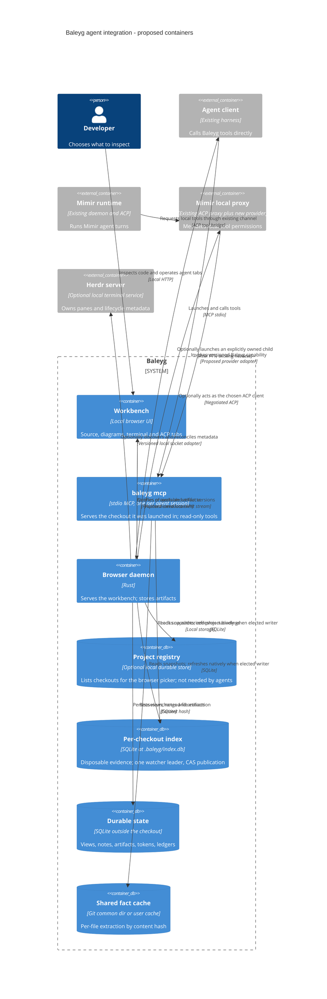

# Proposed agent integration — containers

Direction accepted by the owner (2026-09-23); mechanics proposed until Stage 1 ratifies them. Not
implemented. The stdio MCP server, per-checkout indexes, watcher leadership, file watcher, registry,
Mimir Baleyg provider and artifact service shown here must be implemented. Existing Hands v1 does not
accept arbitrary tools. This is the target architecture: artifact storage, embedded terminal
streaming and ACP client sessions are separate slices. See the [local topology](../local-topology.md).

There is no new ACP observer connection beside an existing editor client. The local proxy and
Baleyg run on the machine holding the inspected workspace; a remote daemon's paths are different.
The Herdr adapter is a daemon component, not another agent harness or replacement pane manager.
Herdr metadata/snapshot APIs do not establish support for raw per-pane terminal embedding. Validate
a supported attach transport before adding that route. ACP protocol stdout is not terminal output.
See the [terminal contract](../terminal-workbench-contract.md).

[Plan and boundaries](../agent-integration-plan.md).
