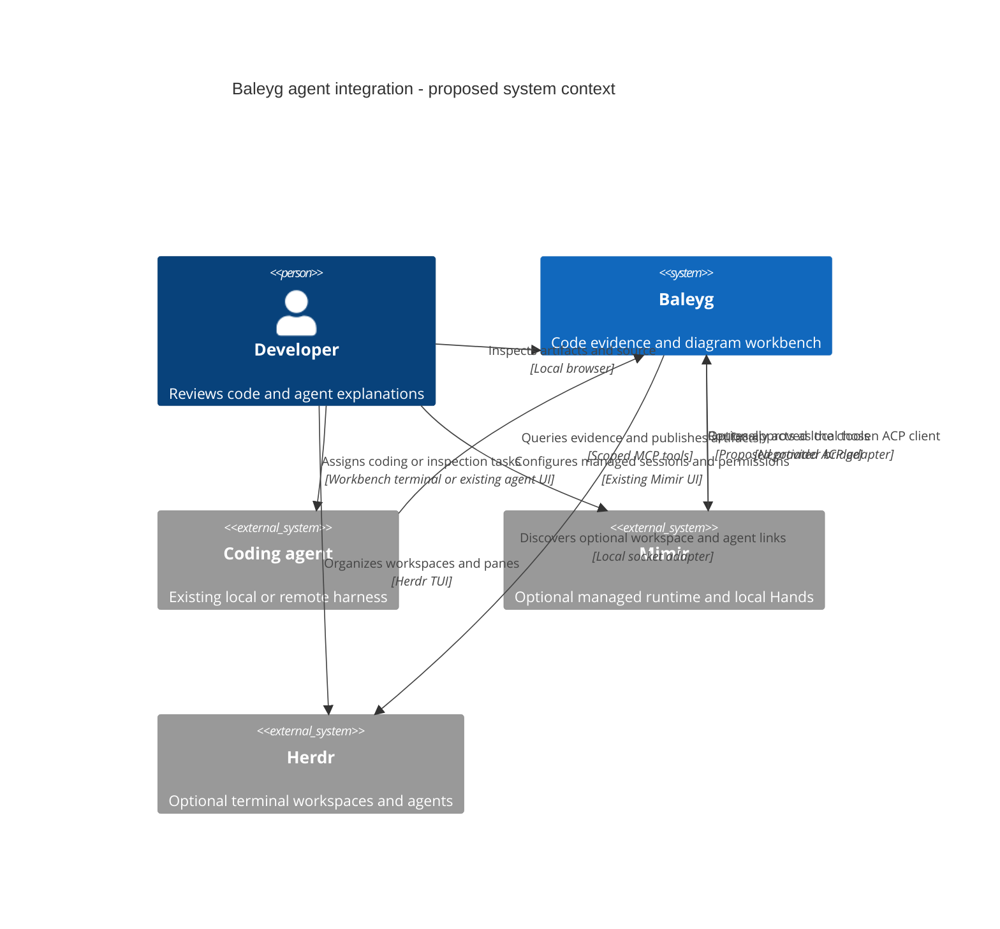

# Proposed agent integration — system context

Proposal only. Direct terminal agents and optional ACP agents use the same MCP contract.
Herdr and Mimir are independent optional integrations. Terminal and ACP tabs in Baleyg are an
accepted target UI, not implemented functionality.

[Plan and boundaries](../agent-integration-plan.md).
