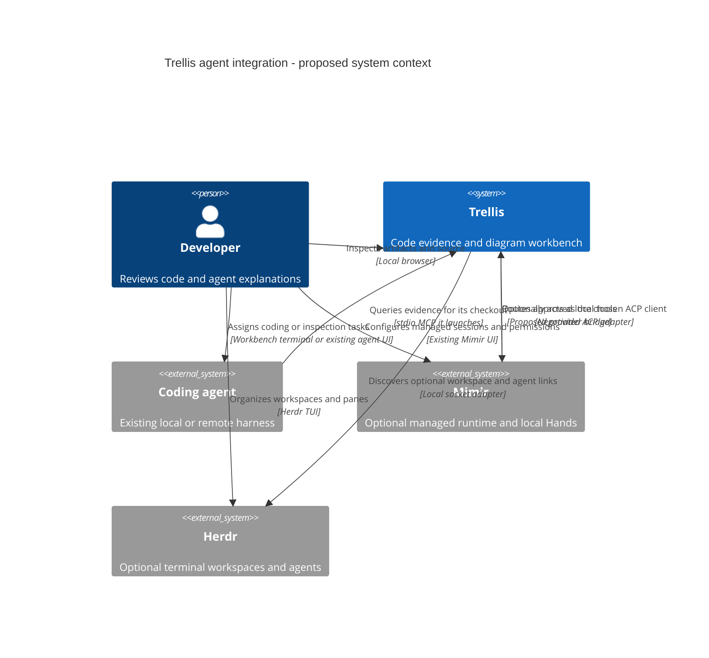

# Proposed agent integration — system context

Not implemented. The per-checkout index and stdio MCP parts follow the owner-accepted
[local topology](../local-topology.md), whose mechanics Stage 1 ratifies; the registry, Mimir, Herdr,
terminal and artifact parts remain proposals with their own later slices. Direct terminal agents and optional ACP agents use the same MCP contract.
Herdr and Mimir are independent optional integrations. Terminal and ACP tabs in Trellis are an
accepted target UI, not implemented functionality.

```mermaid
C4Context
  title Trellis agent integration - proposed system context
  Person(user, "Developer", "Reviews code and agent explanations")
  System(trellis, "Trellis", "Code evidence and diagram workbench")
  System_Ext(agent, "Coding agent", "Existing local or remote harness")
  System_Ext(mimir, "Mimir", "Optional managed runtime and local Hands")
  System_Ext(herdr, "Herdr", "Optional terminal workspaces and agents")
  Rel(user, trellis, "Inspects artifacts and source", "Local browser")
  Rel(user, agent, "Assigns coding or inspection tasks", "Workbench terminal or existing agent UI")
  Rel(trellis, mimir, "Optionally acts as the chosen ACP client", "Negotiated ACP adapter")
  Rel(agent, trellis, "Queries evidence for its checkout", "stdio MCP it launches")
  Rel(user, mimir, "Configures managed sessions and permissions", "Existing Mimir UI")
  Rel(mimir, trellis, "Routes approved local tools", "Proposed provider bridge")
  Rel(user, herdr, "Organizes workspaces and panes", "Herdr TUI")
  Rel(trellis, herdr, "Discovers optional workspace and agent links", "Local socket adapter")
```

[Plan and boundaries](../agent-integration-plan.md).
